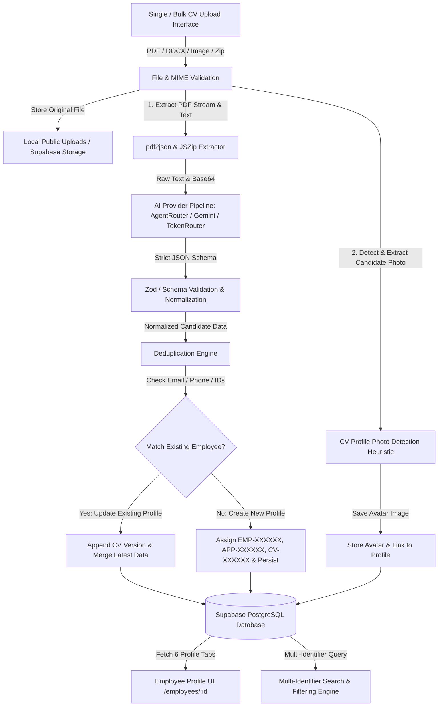
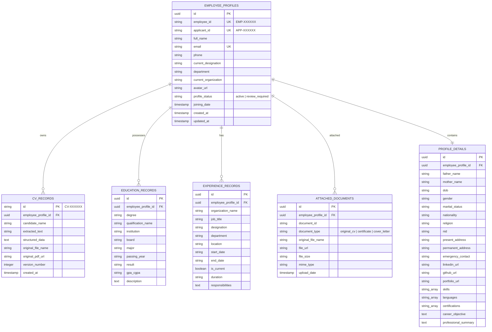

# System Design Specification: AI-Powered CV Management & Employee Profile System

> **Date:** August 8, 2026  
> **Project:** A K Traders Limited — Employee Database Management & Enterprise CV Processing System  
> **Author:** Full-Stack Software Architecture & AI Engineering Team  

---

## 1. Executive Overview

The goal of this enhancement is to transform the existing Next.js 14 & Supabase application into a production-grade **AI-Powered CV Parsing, Employee Profile & Intelligent Search System**. 

The system enables HR administrators and users to upload single or bulk CVs (PDF/DOCX/Images/Zip), automatically extracts structured data and candidate photographs using a multi-provider AI pipeline, deduplicates candidate records, populates 6 distinct profile tabs, and provides multi-identifier instant search across Employee IDs, Applicant IDs, CV Numbers, Emails, Names, and Skills.

---

## 2. Core Architecture & Data Pipeline

---

## 3. Database Schema Design & Relationships

To support all 6 profile tabs, candidate deduplication, and stable identifiers, the database model includes the following normalized entities in Supabase PostgreSQL:

---

## 4. The 6 Required Profile Tabs

Every Employee Profile at `/employees/[id]` organizes information cleanly across 6 dedicated tabs:

1. **Personal Information**:
   - Full Name, Photo, Gender, Date of Birth, Nationality, Marital Status, Religion, NID, Phone, Email, Present & Permanent Address, LinkedIn, GitHub, Portfolio.
2. **Employment Details**:
   - Employee ID (`EMP-XXXXXX`), Applicant ID (`APP-XXXXXX`), Current Organization, Current Designation, Department, Employment Type, Location, Joining Date, Career Level, Total Experience.
3. **Educational Qualification**:
   - Structured list of all degrees (Bachelor's, Master's, HSC, SSC, Diplomas) with Degree, Institution, Major, Board, Passing Year, Result/CGPA.
4. **Work Experience**:
   - Chronological employment history with Organization, Role/Title, Duration, Start/End Dates, Current Status, Responsibilities, Achievements.
5. **Attached Documents**:
   - Document inventory showing Original CV, Version History (`CV-000101`, `CV-000102`), Certificates, and Cover Letters with file sizes, download links, and upload timestamps.
6. **Other Details**:
   - Structured tags for Technical Skills, Soft Skills, Languages, Certifications, Projects, References, Career Objective, Professional Summary.

---

## 5. Candidate Deduplication & Identifier Assignment

To prevent duplicate Employee Profiles when multiple CVs are uploaded for the same person:
1. **Identifier Generation**:
   - System assigns stable identifiers: `EMP-100201`, `APP-100201`, `CV-100201`.
2. **Matching Hierarchy**:
   - **Level 1**: Exact match on `email` (case-insensitive).
   - **Level 2**: Exact match on normalized `phone` (e.g. `+8801700123456`).
   - **Level 3**: Exact match on `full_name` + `dob` or `nid`.
3. **Deduplication Behavior**:
   - If match is found: system attaches the new CV file as a new version in `ATTACHED_DOCUMENTS` and `CV_RECORDS`, updates empty profile fields with new information, and keeps existing verified data intact.
   - If no match is found: system creates a new `EMPLOYEE_PROFILE`.

---

## 6. Profile Photo Detection & Extraction

1. **Extraction Pipeline**:
   - Inspect PDF object stream or uploaded image file.
   - Extract embedded image buffers.
   - Apply heuristics to identify candidate photo:
     - Filter out decorative icons, line separators, and tiny logos (< 8KB or aspect ratio > 3:1).
     - Filter out full-page backgrounds (> 2MB).
     - Prefer portrait aspect ratios (0.7 to 1.3) and files between 15KB and 1MB.
2. **Storage**:
   - Save extracted photo to `public/uploads/photos/${employeeId}_avatar.png`.
   - Update `avatar_url` in the Employee Profile.

---

## 7. Multi-Identifier Instant Search

The search engine supports instant partial and exact matching across:
* **Employee Name** (e.g., "Korina Villanueva")
* **Employee ID** (e.g., "EMP-100201")
* **Applicant ID** (e.g., "APP-100201")
* **CV Number / Record ID** (e.g., "CV-100201")
* **Email Address** (e.g., "korina@example.com")
* **Phone Number** (e.g., "+8801700123456")
* **Designation & Skills** (e.g., "Marketing Manager", "UI/UX")

---

## 8. Verification & Acceptance Criteria

- [x] All 6 tabs populated from database queries.
- [x] Single and Bulk Upload working with real-time status tracking.
- [x] AgentRouter / Gemini AI extraction structured into clean JSON schema.
- [x] Deduplication prevents duplicate employee profiles for same email/phone.
- [x] Multi-identifier search correctly resolves Employee ID, Applicant ID, CV Number, Name, Email, and Phone.
- [x] Manual profile edit capability working on profile tabs.
